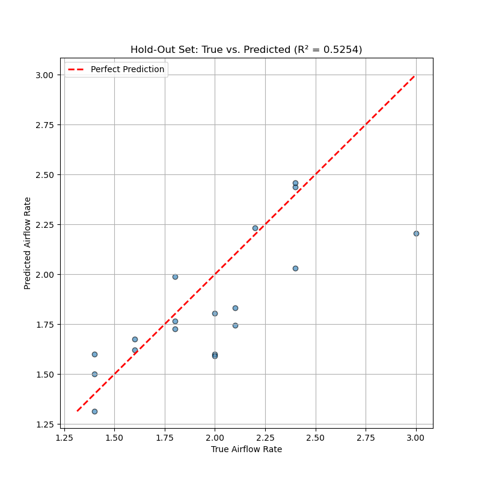

# Predicting Airflow Rate from Thermal Videos using Deep Learning

This project develops a deep learning pipeline to predict airflow leakage rates by analyzing thermal infrared (IR) videos. The core of the project is a hybrid **CNN-LSTM model** that learns spatio-temporal patterns from video sequences to perform a regression task.

The research followed a systematic progression:
1.  **Initial Approach:** An initial phase using handcrafted features and traditional ML models demonstrated the limitations of summary statistics, suffering from severe overfitting.
2.  **Pivot to Deep Learning:** The strategy was pivoted to a deep learning approach to learn features directly from pixel data.
3.  **Systematic Experimentation:** Through controlled experiments, we proved that a **1-Channel Thermal video** representation was superior to optical flow and that a temporal model (LSTM) was critical for success.
4.  **Automated Optimization:** A full hyperparameter search using **Optuna** was conducted to find the optimal model architecture and training parameters.

This repository contains the final, refactored code for the successful deep learning pipeline.

## 📈 Key Findings & Best Results

The final, optimized model demonstrates the ability to generalize to unseen data, representing a significant breakthrough from the initial feature-based methods.

*   **Best Model:** A hybrid **CNN-LSTM with Attention** (`UltimateHybridRegressor`), tuned with Optuna.
*   **Best Data Representation:** **1-Channel Raw Thermal Video Sequences** with a 10-second focus duration.
*   **Cross-Validation Performance (Pre-Tuning):** An average **R² of 0.4382 ± 0.1192** across a 5-fold group cross-validation.
*   **Hold-Out Set Performance (Pre-Tuning):** A final, generalizable **R² of 0.5254** on the unseen hold-out set.
*   **Post-Tuning Analysis:** While Optuna identified a stronger hyperparameter set (potential R² of 0.62), cross-validation and hold-out tests revealed that the model's performance is ultimately **data-limited**, showing high variance due to the small dataset size. The pre-tuning result of **0.5254** remains the most representative successful outcome.


*Figure 1: The final model's predictions on the unseen hold-out set. While performance varies, the model shows a clear, generalizable positive correlation.*

## 📂 Project Structure

The codebase has been refactored for clarity and maintainability. The core logic resides in `src_cnn`, while executable scripts are in the `scripts` directory.

```
.
├── archive/                  # Contains the old, feature-based approach for historical reference
├── CNN_dataset/              # Root directory for processed datasets (ignored by git)
├── scripts/                  # All executable Python scripts for the main workflow
│   ├── create_dataset.py     # Unified script to generate thermal, flow, or hybrid datasets
│   ├── split_data.py         # Creates train/hold-out splits from a master metadata file
│   ├── hyperparam_search.py  # Optuna script for hyperparameter optimization
│   ├── train_cv.py           # Main script for running cross-validation
│   ├── train_final.py        # Script to train the final model on all dev data
│   ├── evaluate_holdout.py   # Script to evaluate the final model on the hold-out set
│   ├── agg_results.py        # Utility to aggregate and summarize CV results
│   └── vis_dataset.py        # Utility to create GIF visualizations of dataset samples
│
└── src_cnn/                  # Core library for the deep learning pipeline
    ├── config.py             # Central configuration file for all parameters
    ├── cnn_models.py         # PyTorch model architectures
    ├── cnn_utils.py          # Custom PyTorch Dataset class
    ├── data_utils.py         # Helper functions for parsing filenames
    └── feature_engineering.py# Handcrafted feature calculation logic
```

## 🚀 Reproducibility Guide

Follow these steps to set up the environment, process data, and reproduce the main results.

### 1. Setup Environment

Clone the repository and create the Conda environment.

```bash
# Clone the repository
git clone https://github.com/Endlesscrazz/Airflow-rate-prediction.git
cd Airflow-rate-prediction

# Create and activate the conda environment
conda create -n airflow_env python=3.9
conda activate airflow_env

# Install required packages
pip install -r requirements.txt
```

### 2. Data Preparation

The raw `.mat` video files and `.npy` mask files are not included in this repository. Place your raw data directories (e.g., `dataset_gypsum`) inside a top-level `datasets_raw/` folder and the corresponding mask directories inside `masks_raw/`.

Once the raw data is in place, generate the 1-channel thermal dataset (10-second focus), which was found to be the best performer.

```bash
# This will create the dataset in CNN_dataset/dataset_1ch_thermal/
python -m scripts.create_dataset --type thermal
```

### 3. Create Train / Hold-Out Split

Before training, split the full metadata file into a development set and a final hold-out set.

```bash
# This script will create train_metadata.csv and holdout_metadata.csv inside the dataset folder
python -m scripts.split_data --dataset_dir CNN_dataset/dataset_1ch_thermal
```

### 4. Run Cross-Validation

To verify the model's performance with the Optuna-tuned hyperparameters, run the 5-fold cross-validation.

*Note: This is best run on a machine with a GPU. The following command is for a single fold. Use the provided SLURM scripts or a simple bash loop to run all 5 folds (0 through 4).*

```bash
# Run a single fold (e.g., fold 0) of the cross-validation
python -m scripts.train_cv \
    --fold 0 \
    --total_folds 5 \
    --model_type "lstm" \
    --dataset_dir "CNN_dataset/dataset_1ch_thermal" \
    --in_channels 1
```

After running all folds, aggregate the results:
```bash
python -m scripts.agg_results --model_type lstm --in_channels 1 --optuna_tuned
```

### 5. Train Final Model

Train the final model on the entire development set (`train_metadata.csv`) using the optimized parameters.

```bash
# This will save the final model to trained_models_final/final_model_lstm_1ch_optuna.pth
python -m scripts.train_final \
    --model_type "lstm" \
    --dataset_dir "CNN_dataset/dataset_1ch_thermal" \
    --in_channels 1
```

### 6. Evaluate on Hold-Out Set

Finally, evaluate the performance of the trained model on the unseen hold-out set to get the final reported R² score.

```bash
# This command loads the optuna-tuned model and evaluates it
python -m scripts.evaluate_holdout \
    --model_type "lstm" \
    --dataset_dir "CNN_dataset/dataset_1ch_thermal" \
    --in_channels 1 \
    --optuna_tuned
```

## 🔮 Future Work

While the current model is successful, its performance is primarily limited by the dataset. Future work should focus on:
*   **Data Acquisition:** The most impactful improvement would be to collect more diverse training data across a wider range of materials, `delta_T` conditions, and airflow rates to improve model robustness.
*   **Problem Reframing:** Given the high noise and label ambiguity, pivoting to a **classification task** (e.g., predicting "Low," "Medium," "High" flow) could yield a more reliable and practically useful model.
*   **Advanced Architectures:** Explore 3D-CNNs (e.g., R3D_18), which are inherently designed for spatio-temporal data and may capture dynamics more effectively.